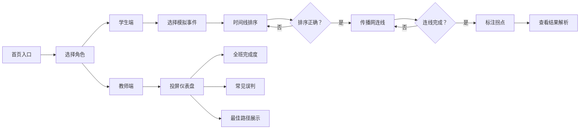

## 1. 产品概述

面向高校新闻传播课程的互动式纯前端教学工具，将谣言扩散路径分析转化为沉浸式课堂演练。通过「找源头、连路径、判拐点」三步核心玩法，让学生在动手操作中理解信源核查、二次传播和舆情扩散机制。

- 目标用户：高校新闻传播专业师生
- 核心价值：将抽象的传播理论转化为可视化、可操作的互动体验
- 使用场景：课堂集体教学、小组讨论、课后练习

## 2. 核心功能

### 2.1 用户角色

| 角色 | 进入方式 | 核心权限 |
|------|----------|----------|
| 学生 | 直接进入学生端 | 选择事件、完成三步玩法、查看个人答案与反馈 |
| 教师 | 切换至教师投屏页 | 查看全班完成度、常见误判、最佳路径答案展示 |

### 2.2 功能模块

1. **事件选择页**：三个模拟事件卡片（校园食品安全、考试政策变动、名人假消息），点击进入对应演练
2. **时间线排序玩法**：拖拽信息卡片到时间线上，按发布时间排序
3. **传播网连线玩法**：在节点间连线，构建转述/转发关系
4. **拐点标注玩法**：选择关键拐点，标注谣言从讨论变舆情的转折点
5. **即时反馈系统**：每步操作实时反馈正误，提示节点属性（跟风评论/放大节点/源头）
6. **教师投屏页**：全班完成度统计、常见误判热力图、最佳路径展示

### 2.3 页面详情

| 页面名称 | 模块名称 | 功能描述 |
|---------|---------|----------|
| 首页/入口页 | 角色选择 | 学生端入口 + 教师端入口切换 |
| 事件选择页 | 事件卡片 | 三个模拟事件卡片，展示事件简介和难度 |
| 时间线排序页 | 卡片池 | 打乱顺序的信息卡片，可拖拽 |
| 时间线排序页 | 时间轴 | 放置卡片的时间槽，自动吸附 |
| 时间线排序页 | 提交校验 | 检查排序正确性，给出反馈 |
| 传播网连线页 | 节点画布 | 展示所有信息节点，可拖拽位置 |
| 传播网连线页 | 连线工具 | 点击两个节点建立传播关系 |
| 传播网连线页 | 反馈提示 | 实时显示连线正误，标注节点类型 |
| 拐点标注页 | 拐点选择 | 学生选择哪次改写是舆情拐点 |
| 拐点标注页 | 结果解析 | 展示正确答案和传播机制解析 |
| 教师投屏页 | 完成度仪表盘 | 展示全班进度统计 |
| 教师投屏页 | 常见误判 | 展示错误率最高的连线/排序 |
| 教师投屏页 | 最佳路径 | 一键展示标准答案和讲解要点 |

## 3. 核心流程

学生进入首页 → 选择学生端 → 选择模拟事件 → 第一步：时间线排序（拖拽卡片到时间轴）→ 提交验证 → 第二步：传播网连线（连接转述关系）→ 实时反馈 → 第三步：标注拐点 → 查看结果解析 → 完成演练

## 4. 用户界面设计

### 4.1 设计风格

**整体风格**：学术杂志 + 数据新闻风格，严肃中带有互动趣味

- **主色调**：深蓝 #1e3a5f（专业、信任）+ 橙红 #e63946（警示、谣言标签）
- **辅助色**：金色 #d4a574（关键点/拐点高亮）、浅灰蓝 #f0f4f8（背景）
- **中性色**：米白 #faf8f5（页面背景）、深灰 #2d2d2d（正文）
- **字体**：标题用「Source Serif Pro」衬线字体（学术感），正文用「Inter」无衬线（可读性）
- **卡片风格**：轻微阴影 + 圆角 8px，选中态有金色边框
- **按钮风格**：实心圆角按钮，悬停有微妙放大效果
- **图标**：lucide-react 线性图标

### 4.2 页面设计概述

| 页面名称 | 模块名称 | UI 元素 |
|---------|---------|---------|
| 事件选择页 | 事件卡片 | 大卡片、事件标题、简介标签、难度指示、进入按钮 |
| 时间线排序页 | 卡片池 | 横向滚动卡片列表，卡片模拟社交媒体帖子样式 |
| 时间线排序页 | 时间轴 | 左侧垂直时间线，时间节点有吸附槽 |
| 时间线排序页 | 反馈提示 | 卡片边框变色（绿色正确/红色错误），抖动动画 |
| 传播网连线页 | 节点画布 | 自由布局画布，节点为圆形/卡片式 |
| 传播网连线页 | 连线 | SVG贝塞尔曲线，正确绿色/错误红色 |
| 传播网连线页 | 节点类型标签 | 源头（金色皇冠）、放大节点（红色火焰）、跟风（灰色） |
| 拐点标注页 | 时间线高亮 | 拐点处金色脉冲动画 |
| 教师投屏页 | 仪表盘 | 大数字、进度条、数据卡片 |
| 教师投屏页 | 答案展示 | 完整传播网动画演示 |

### 4.3 响应式

- 桌面端优先设计（课堂投影 + 学生电脑）
- 时间线和传播网画布支持鼠标拖拽
- 教师投屏页优化大字体和高对比度
- 支持平板横屏使用

### 4.4 动效与交互

- 卡片拖拽：拖拽时卡片上浮+阴影加深
- 连线绘制：点击起点后跟随鼠标的引导线
- 正确反馈：绿色光晕 + 轻微缩放
- 错误反馈：红色边框 + 左右抖动
- 页面切换：淡入淡出过渡
- 教师端答案展示：逐节点动画呈现传播路径
