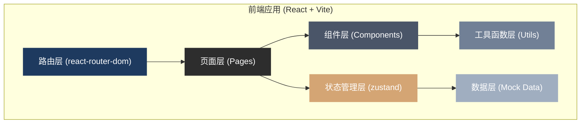

## 1. 架构设计



## 2. 技术描述

- **前端框架**：React 18 + TypeScript
- **构建工具**：Vite 5
- **样式方案**：TailwindCSS 3
- **状态管理**：zustand
- **路由方案**：react-router-dom
- **图标库**：lucide-react
- **拖拽库**：@dnd-kit/core + @dnd-kit/sortable（时间线拖拽）
- **图形绘制**：原生 SVG（传播网连线）
- **后端**：无（纯前端应用，数据使用 mock）
- **数据库**：无（使用 localStorage 模拟学生进度存储）

## 3. 路由定义

| 路由路径 | 页面名称 | 用途 |
|---------|---------|------|
| `/` | 首页/入口选择 | 学生端与教师端入口选择 |
| `/student` | 学生端-事件选择 | 学生选择模拟事件 |
| `/student/timeline/:eventId` | 学生端-时间线排序 | 第一步：按时间排序卡片 |
| `/student/network/:eventId` | 学生端-传播网连线 | 第二步：连接传播关系 |
| `/student/turning/:eventId` | 学生端-拐点标注 | 第三步：标注舆情拐点 |
| `/student/result/:eventId` | 学生端-结果解析 | 查看答案和传播机制解析 |
| `/teacher` | 教师端-投屏首页 | 教师端仪表盘入口 |
| `/teacher/dashboard/:eventId` | 教师端-事件仪表盘 | 展示完成度、误判、最佳路径 |

## 4. 数据模型

### 4.1 事件 (Event)

```typescript
interface Event {
  id: string;
  title: string;
  description: string;
  difficulty: 'easy' | 'medium' | 'hard';
  coverImage: string;
  nodes: PostNode[];
  correctOrder: string[]; // 按时间排序的节点ID数组
  correctEdges: Edge[];   // 正确的传播关系
  turningPointId: string; // 拐点节点ID
  turningPointExplanation: string;
}
```

### 4.2 帖子节点 (PostNode)

```typescript
interface PostNode {
  id: string;
  type: 'source' | 'amplifier' | 'follower' | 'comment';
  platform: 'weibo' | 'wechat' | 'douyin' | 'xiaohongshu' | 'forum';
  author: string;
  avatar: string;
  content: string;
  timestamp: number; // Unix 时间戳
  timeLabel: string; // 显示用时间，如 "6月1日 08:30"
  likeCount: number;
  repostCount: number;
  commentCount: number;
  isScreenshot: boolean; // 是否为转发截图
  commentSnippet?: string; // 评论片段
  position?: { x: number; y: number }; // 画布默认位置
}
```

### 4.3 传播边 (Edge)

```typescript
interface Edge {
  id: string;
  source: string; // 源节点ID
  target: string; // 目标节点ID
  type: 'direct-repost' | 'adaptation' | 'comment' | 'mention';
  explanation?: string;
}
```

### 4.4 学生答题状态

```typescript
interface StudentProgress {
  eventId: string;
  timelineOrder: string[]; // 学生排列的顺序
  timelineScore: number;
  studentEdges: Edge[]; // 学生画的连线
  networkScore: number;
  selectedTurningPoint: string | null;
  turningPointCorrect: boolean;
  completedAt: number | null;
}
```

### 4.5 教师端统计数据

```typescript
interface ClassStats {
  eventId: string;
  totalStudents: number;
  completedStudents: number;
  averageTimelineScore: number;
  averageNetworkScore: number;
  commonMistakes: {
    type: 'order' | 'edge' | 'turning';
    description: string;
    count: number;
  }[];
  bestPathRevealed: boolean;
}
```

## 5. 组件结构

```
src/
├── components/
│   ├── layout/
│   │   ├── Header.tsx          # 顶部导航
│   │   └── StepIndicator.tsx   # 步骤指示器
│   ├── timeline/
│   │   ├── DraggableCard.tsx   # 可拖拽卡片
│   │   ├── TimelineTrack.tsx   # 时间轴轨道
│   │   └── TimeSlot.tsx        # 时间槽
│   ├── network/
│   │   ├── NetworkCanvas.tsx   # 传播网画布
│   │   ├── NetworkNode.tsx     # 传播节点
│   │   └── ConnectionLine.tsx  # 连接线
│   ├── common/
│   │   ├── EventCard.tsx       # 事件卡片
│   │   ├── FeedbackBadge.tsx   # 反馈徽章
│   │   └── Button.tsx          # 按钮组件
│   └── teacher/
│       ├── StatsCard.tsx       # 统计卡片
│       ├── MistakeList.tsx     # 常见误判列表
│       └── AnswerReveal.tsx    # 答案展示
├── pages/
│   ├── HomePage.tsx            # 首页入口
│   ├── EventSelectPage.tsx     # 事件选择
│   ├── TimelinePage.tsx        # 时间线排序
│   ├── NetworkPage.tsx         # 传播网连线
│   ├── TurningPointPage.tsx    # 拐点标注
│   ├── ResultPage.tsx          # 结果解析
│   └── TeacherDashboard.tsx    # 教师仪表盘
├── store/
│   ├── useGameStore.ts         # 游戏状态
│   └── useClassStore.ts        # 班级统计状态
├── data/
│   ├── events/
│   │   ├── foodSafety.ts       # 校园食品安全事件
│   │   ├── examPolicy.ts       # 考试政策变动事件
│   │   └── celebrityRumor.ts   # 名人假消息事件
│   └── index.ts                # 数据汇总导出
├── utils/
│   ├── validation.ts           # 校验函数
│   ├── svg.ts                  # SVG 绘图工具
│   └── format.ts               # 格式化工具
└── types/
    └── index.ts                # 类型定义
```

## 6. 核心交互实现方案

### 6.1 时间线拖拽排序
- 使用 @dnd-kit 实现拖拽
- 垂直时间轴，卡片拖入时间槽自动吸附
- 实时计算排序分数

### 6.2 传播网连线
- SVG 画布，节点可拖拽调整位置
- 点击起点节点 → 鼠标移动显示引导线 → 点击终点节点完成连线
- 每条连线立即校验并显示颜色反馈
- 支持右键/双击删除连线

### 6.3 拐点标注
- 在时间线/传播网上点击选择拐点
- 金色高亮动画标识选中状态
- 提交后显示解析

### 6.4 教师端投屏
- 模拟班级数据（mock 20-30名学生的答题情况）
- 三个 Tab：完成度、常见误判、最佳路径
- 最佳路径有动画演示效果
